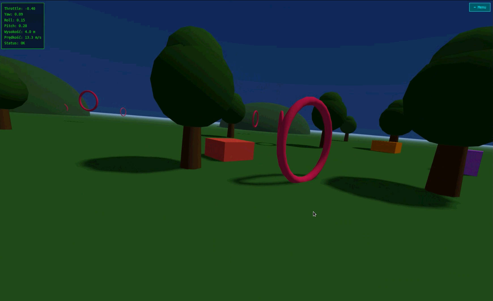

# 🚁 BetaFPV Web Sim

**Przeglądarkowy symulator drona FPV** sterowany fizyczną aparaturą **BetaFPV LiteRadio 2 SE** przez **WebHID API**.

Projekt napisany w całości w JavaScript (ES Modules) z wykorzystaniem **Three.js** do renderowania 3D. Nie wymaga instalacji — wystarczy przeglądarka oparta na Chromium.

[🇬🇧 English](README.md) · 🇵🇱 **Polski**




🔗 **Demo na żywo:** https://betafpv.vercel.app

---

## ✨ Funkcje

- 🎮 **Bezpośrednia obsługa BetaFPV LiteRadio 2 SE** przez WebHID — bez sterowników.
- 🗺️ **Kreator mapowania osi** — ruszasz drążkami, program pokazuje, które pary bajtów się poruszają, a Ty przypisujesz je do funkcji drona.
- 🎯 **Automatyczna kalibracja zakresów** — program mierzy min/max/center dla każdej osi.
- 🌍 **Cztery poziomy trudności** — Łatwa / Średnia / Ekspert / Race, z różną fizyką i scenografią.
- 👻 **Ghost Replay** — Twój poprzedni najlepszy czas jest zapisywany lokalnie i ściga Cię. Pobij go, przegraj z nim albo **strąć go z nieba**.
- 🎨 **Scena 3D w Three.js** — niebo z shaderem gradientowym, mgła, cienie PCFSoft, drzewa, górki, woda, bramki i przeszkody.
- 📊 **HUD w czasie rzeczywistym** — throttle, yaw, roll, pitch, wysokość, prędkość, licznik bramek, timer i delta względem ducha.
- 🧭 **Przełącznik kąta kamery FPV** — 0° / 20° / 35° na 3-pozycyjnym przełączniku aparatury.
- 🌐 **Dwujęzyczny interfejs** — polski / angielski z automatycznym wykrywaniem języka.
- 🔄 **Auto-połączenie** — automatycznie łączy się z aparaturą przy starcie, jeśli była wcześniej autoryzowana.
- 🛠️ **Narzędzie diagnostyczne** — `detector.html` do analizy surowych raportów HID.

---

## ⚙️ Wymagania

### Przeglądarka

- **Chrome / Edge / Opera / Brave** w wersji **89+** z obsługą WebHID.
- ❌ Firefox i Safari **nie obsługują WebHID**.
- Strona musi być serwowana przez **HTTPS** lub z `localhost`.
- WebHID nie działa z `file://`.

### Sprzęt

- **BetaFPV LiteRadio 2 SE** (VID `0x0483`, PID `0x5750`).
- Kabel USB.
- Aparatura musi być w trybie **Joystick**, a nie w trybie ładowania.

### Serwer lokalny

Wystarczy dowolny lokalny serwer HTTP:

```bash
# Python 3
python -m http.server 8000

# Node.js
npx serve .

# PHP
php -S localhost:8000
```

Następnie otwórz:

```text
http://localhost:8000
```

---

## 🎮 Jak korzystać

### Krok 1/4 — Podłącz aparaturę

Kliknij **Connect radio** i wybierz z listy urządzeń **BETAFPV Joystick**.

### Krok 2/4 — Mapowanie osi

Ruszaj każdym drążkiem w każdą stronę i obserwuj, które paski się poruszają. Następnie przypisz odpowiednie pary bajtów (`P0–P7`) do funkcji drona:

| Funkcja | Drążek | Kierunek |
|---|---|---|
| THROTTLE | Lewy | Góra / Dół |
| YAW | Lewy | Lewo / Prawo |
| PITCH | Prawy | Góra / Dół |
| ROLL | Prawy | Lewo / Prawo |
| CAMERA | Przełącznik SA/SB/SC | 3-pozycyjny |

Nieprzypisane pary (`---`) są ignorowane przez symulator.

> ⚠️ **Ważne:** Mapowanie trzeba powtórzyć po każdym odświeżeniu strony. Aparatura przy każdym połączeniu generuje sygnał na innych parach bajtów, dlatego mapowania nie można zapisać na stałe. Kalibracja jest pamiętana w przeglądarce, dopóki aparatura pozostaje podłączona.

### Krok 3/4 — Kalibracja zakresów

Program poprosi Cię kolejno o ruszanie każdą funkcją.

Ruszaj drążkiem do oporu w obie strony. Kalibracja trwa około **4 sekund na funkcję**, czyli około **16 sekund łącznie**.

### Krok 4/4 — Wybór świata

Wybierz poziom trudności i startuj.

W trakcie lotu możesz wrócić do menu przyciskiem **⬅ Menu** w prawym górnym rogu.

---

## 🕹️ Sterowanie

### Drążki aparatury — Mode 2

| Funkcja | Drążek | Efekt |
|---|---|---|
| Throttle | Lewy ↑↓ | Ciąg silników |
| Yaw | Lewy ←→ | Obrót wokół osi pionowej |
| Pitch | Prawy ↑↓ | Pochylenie przód / tył |
| Roll | Prawy ←→ | Pochylenie na boki |

### Klawiatura

| Klawisz | Akcja |
|---|---|
| `P` | Pauza / wznowienie |
| `Spacja` | Włączenie / wyłączenie celownika OSD |
| `K` | Zmiana kąta kamery |
| `R` | Awaryjny pełny restart — bez zapisu rekordu |
| `M` | Master mute — silnik + muzyka |
| `N` | Wyciszenie tylko silnika |
| `B` | Wyciszenie tylko muzyki tła |

---

## 👻 Ghost Replay

Symulator zapisuje Twój najlepszy czas przejazdu dla każdego świata w `localStorage`.

Klucz zapisu:

```text
betafpv_ghost_<worldId>
```

Przy kolejnym locie półprzezroczysty dron-duch ściga Cię po Twojej poprzedniej trajektorii.

### Przebieg wyścigu

Ghost startuje dopiero po przeleceniu przez **bramkę #1**. W tym momencie startuje również timer.

Pojawia się 6-sekundowe intro:

> 👻 Twój poprzedni wynik goni Cię! Rekord: XX.XXXs

### Trzy możliwe scenariusze

- 🏆 **Wygrywasz** — dolatujesz do ostatniej bramki pierwszy. Wynik pokazuje Twój czas oraz czas ducha.
- 🍌 **Przegrywasz** — duch pierwszy dociera do mety. Możesz nadal dokończyć swój lot.
- 💥 **Niszczysz ducha** — taranujesz go od tyłu, gdy jesteś przed nim. Pojawia się komunikat **ZNISZCZYŁEŚ DUCHA!**, płomienie i efekt screen shake.

Symulator automatycznie resetuje się **3 sekundy** po zakończeniu wyniku.

Klawisz `R` uruchamia awaryjny restart. Rekord nie jest zapisywany.

---

## 🛠️ Jak dodawać przeszkody do torów

Pliki torów znajdują się w katalogu `worlds/` — jeden moduł na świat.

Pełne instrukcje:

- 🇵🇱 Polski: `worlds/info_pl.txt`
- 🇬🇧 English: `worlds/info_en.txt`

---

## ❌ Nie działa bezpośrednio

### Pady XInput

Pady Xbox, DualShock i DualSense nie są dostępne przez WebHID ze względów bezpieczeństwa.

Obsługa wymagałaby migracji na **Gamepad API**.

### DJI RC-N1

DJI RC-N1 używany z Mini 2 / Air 2 / Mini 3 po podłączeniu przez USB nie jest rozpoznawany jako urządzenie HID.

Wymaga zewnętrznego konwertera, np. `DJI_RC-N1_SIMULATOR_FLY_DCL`, oraz Gamepad API.

### Radiomaster / TBS

Radiomaster Zorro / Pocket oraz TBS Tango 2 są teoretycznie kompatybilne w trybie USB Joystick, ale wymagają zmiany VID/PID w kodzie.

---

## 🚧 Znane problemy / TODO

| # | Problem | Priorytet |
|---:|---|---|
| 1 | Autoplay policy na localhost — Vercel działa, localhost wymaga kliknięcia | Niski |
| 2 | Mapowanie osi nie zapisuje się — ograniczenie WebHID | Średni |
| 3 | Pady XInput nie działają — wymaga Gamepad API | Średni |
| 4 | DJI RC-N1 nie działa — wymaga konwertera | Niski |
| 5 | Weryfikacja maksymalnej liczby słyszalnych bramek (raycast) | Niski |
| 6 | `img/poster.jpg` nieużywany — usunięty z `<video>` | Kosmetyczny |

---

## 🤝 Wkład w projekt

Pull requesty i zgłoszenia błędów są mile widziane!

Jeśli chcesz dodać obsługę nowej aparatury, otwórz Issue i podaj:

- nazwę modelu,
- VID / PID,


---

## 📜 Licencja

Projekt udostępniany na licencji **MIT**.

---

## 🙏 Podziękowania

- **Three.js** — silnik 3D
- **WebHID API** — obsługa aparatury
- **Społeczność FPV** — feedback i testy

---

🇬🇧 **[Read the English version →](README.md)**

🔗 **[Uruchom symulator →](https://betafpv.vercel.app)**

**Miłego latania! 🚁💨**
